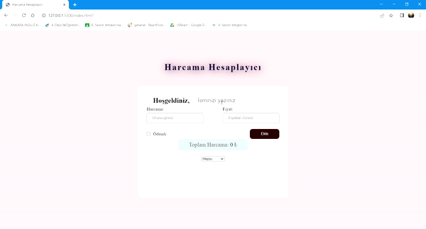

<h1> Calculator/Hesaplayıcı</h1>

I am here with an expense calculator. In this project, I designed a card using HTML5 and CSS3. Then, I made the card active with JavaScript. I created a dynamic list that updates as you enter items. I added buttons to the list and activated a delete button. As you add or remove items from the list, the price is updated.

<h2> Used Technologies </h2>

HTML5, CSS3, JS

<h2> SCREENSHOT </h2>

